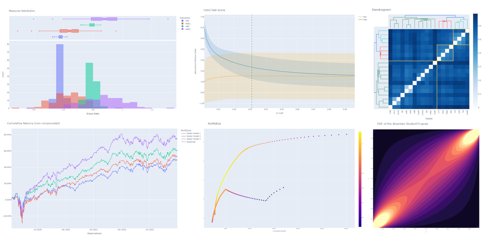

:og:description: skfolio is a Python library for portfolio optimization built on top of scikit-learn

.. meta::
    :keywords: skfolio, portfolio, optimization, portfolio optimization, scikit-learn, quantitative, trading

.. toctree::
   :hidden:

    User guide <user_guide/index>
    Examples <auto_examples/index>
    API Reference <api>

=======
skfolio
=======

`skfolio` is a Python library for portfolio optimization built on top of scikit-learn.
It provides a unified interface and `sklearn` compatible tools to build, tune and
cross-validate portfolio models.

Installation
************

``skfolio`` is available on PyPI and can be installed with:

.. code:: console

    $ pip install skfolio

Key Concepts
************
Since the development of modern portfolio theory by Markowitz (1952), mean-variance optimization (MVO)
has received considerable attention. Unfortunately it faces a number of shortcomings including high sensitivity to the
input parameters (expected returns and covariance), weight concentration, high turnover and poor out-of-sample
performance.
It is well known that naive allocation (1/N, inverse-vol, ...) tends to outperform MVO out-of-sample (DeMiguel, 2007).

Numerous approaches have been developed to alleviate these shortcomings (shrinkage,
additional constraints, regularization, uncertainty set, higher moments, bayesian approaches, coherent risk measures,
left-tail risk optimization, distributionally robust optimization, factor model, risk-parity, hierarchical clustering,
ensemble methods...)

With this large number of methods, added to the fact that they can be composed together there is the need for an
unified framework to perform model selection, validation and parameter tuning while reducing the risk of data leakage
and overfitting. This framework is build on scikit-learn's API.

Available models
****************
The current release contains:

* Optimization estimators:
    * Naive:
        * Equal-Weighted
        * Inverse-Volatility
        * Random (dirichlet)
    * Convex:
        * Mean-Risk
        * Risk Budgeting
        * Maximum Diversification
        * Distributionally Robust CVaR
    * Clustering:
        * Hierarchical Risk Parity
        * Hierarchical Equal Risk Contribution
        * Nested Clusters Optimization
    * Ensemble methods:
        * Stacking Optimization

* Moment estimators:
    * Expected Returns:
        * Empirical
        * Exponentially Weighted
        * Equilibrium
        * Shrinkage (James-Stein, Bayes-Stein, ...)
    * Covariance:
        * Empirical
        * Gerber
        * Denoising
        * Denoting
        * Exponentially Weighted
        * Ledoit-Wolf
        * Oracle Approximating Shrinkage
        * Shrunk Covariance
        * Graphical lasso CV

* Distance estimator:
    * Pearson Distance
    * Kendall Distance
    * Spearman Distance
    * Covariance Distance (based on any of the above covariance estimators)
    * Distance Correlation
    * Variation of Information

* Prior estimators:
    * Empirical
    * Black & Litterman
    * Factor Model

* Uncertainty Set estimators:
    * On Expected Returns:
        * Empirical
        * Circular Bootstrap
    * On Covariance:
        * Empirical
        * Circular bootstrap

* Pre-Selection transformers:
    * Non-Dominated Selection
    * Select K Extremes (Best or Worst)
    * Drop Highly Correlated Assets

* Cross-Validation and Model Selection:
    * Compatible with all `sklearn` methods (KFold, ...)
    * Walk Forward
    * Combinatorial Purged Cross-validation

* Hyper-Parameter Tuning:
    * Compatible with all `sklearn` methods (GridSearchCV, RandomizedSearchCV, ...)

* Risk Measures:
    * Variance
    * Semi-Variance
    * Mean Absolute Deviation
    * First Lower Partial Moment
    * CVaR (Conditional Value at Risk)
    * EVaR (Entropic Value at Risk)
    * Worst Realization
    * CDaR (Conditional Drawdown at Risk)
    * Maximum Drawdown
    * Average Drawdown
    * EDaR (Entropic Drawdown at Risk)
    * Ulcer Index
    * Gini Mean Difference
    * Value at Risk
    * Drawdown at Risk
    * Entropic Risk Measure
    * Fourth Central Moment
    * Fourth Lower Partial Moment
    * Skew
    * Kurtosis

Quickstart
**********
The code snippets below are designed to introduce ``skfolio``'s functionality so you can start using it quickly.
For more detailed information see the :ref:`general_examples`,  :ref:`user_guide` and :ref:`api` .

Imports
~~~~~~~
.. code-block:: python

    from sklearn import set_config
    from sklearn.model_selection import (
        GridSearchCV,
        KFold,
        RandomizedSearchCV,
        train_test_split,
    )
    from sklearn.pipeline import Pipeline
    from scipy.stats import loguniform

    from skfolio import RatioMeasure, RiskMeasure
    from skfolio.datasets import load_factors_dataset, load_sp500_dataset
    from skfolio.model_selection import (
        CombinatorialPurgedCV,
        WalkForward,
        cross_val_predict,
    )
    from skfolio.moments import (
        DenoiseCovariance,
        DenoteCovariance,
        EWMu,
        GerberCovariance,
        ShrunkMu,
    )
    from skfolio.optimization import (
        MeanRisk,
        NestedClustersOptimization,
        ObjectiveFunction,
        RiskBudgeting,
    )
    from skfolio.pre_selection import SelectKExtremes
    from skfolio.preprocessing import prices_to_returns
    from skfolio.prior import BlackLitterman, EmpiricalPrior, FactorModel
    from skfolio.uncertainty_set import BootstrapMuUncertaintySet

Load Dataset
~~~~~~~~~~~~
.. code-block:: python

    prices = load_sp500_dataset()

Train/Test split
~~~~~~~~~~~~~~~~
.. code-block:: python

    X = prices_to_returns(prices)
    X_train, X_test = train_test_split(X, test_size=0.33, shuffle=False)

Minimum Variance
~~~~~~~~~~~~~~~~
.. code-block:: python

    model = MeanRisk()

Fit on training set
~~~~~~~~~~~~~~~~~~~
.. code-block:: python

    model.fit(X_train)

    print(model.weights_)

Predict on test set
~~~~~~~~~~~~~~~~~~~
.. code-block:: python

    portfolio = model.predict(X_test)

    print(portfolio.annualized_sharpe_ratio)
    print(portfolio.summary())

Maximum Sortino Ratio
~~~~~~~~~~~~~~~~~~~~~
.. code-block:: python

    model = MeanRisk(
        objective_function=ObjectiveFunction.MAXIMIZE_RATIO,
        risk_measure=RiskMeasure.SEMI_VARIANCE,
    )

Denoised Covariance & Shrunk Expected Returns
~~~~~~~~~~~~~~~~~~~~~~~~~~~~~~~~~~~~~~~~~~~~~
.. code-block:: python

    model = MeanRisk(
        objective_function=ObjectiveFunction.MAXIMIZE_RATIO,
        prior_estimator=EmpiricalPrior(
            mu_estimator=ShrunkMu(), covariance_estimator=DenoiseCovariance()
        ),
    )

Uncertainty Set on Expected Returns
~~~~~~~~~~~~~~~~~~~~~~~~~~~~~~~~~~~
.. code-block:: python

    model = MeanRisk(
        objective_function=ObjectiveFunction.MAXIMIZE_RATIO,
        mu_uncertainty_set_estimator=BootstrapMuUncertaintySet(),
    )

Weight Constraints & Transaction Costs
~~~~~~~~~~~~~~~~~~~~~~~~~~~~~~~~~~~~~~
.. code-block:: python

    model = MeanRisk(
        min_weights={"AAPL": 0.10, "JPM": 0.05},
        max_weights=0.8,
        transaction_costs={"AAPL": 0.0001, "RRC": 0.0002},
        groups=[
            ["Equity"] * 3 + ["Fund"] * 5 + ["Bond"] * 12,
            ["US"] * 2 + ["Europe"] * 8 + ["Japan"] * 10,
        ],
        linear_constraints=[
            "Equity <= 0.5 * Bond",
            "US >= 0.1",
            "Europe >= 0.5 * Fund",
            "Japan <= 1",
        ],
    )
    model.fit(X_train)

Risk Parity on CVaR
~~~~~~~~~~~~~~~~~~~
.. code-block:: python

    model = RiskBudgeting(risk_measure=RiskMeasure.CVAR)

Risk Parity & Gerber Covariance
~~~~~~~~~~~~~~~~~~~~~~~~~~~~~~~
.. code-block:: python

    model = RiskBudgeting(
        prior_estimator=EmpiricalPrior(covariance_estimator=GerberCovariance())
    )

Nested Cluster Optimization with cross-validation and parallelization
~~~~~~~~~~~~~~~~~~~~~~~~~~~~~~~~~~~~~~~~~~~~~~~~~~~~~~~~~~~~~~~~~~~~~
.. code-block:: python

    model = NestedClustersOptimization(
        inner_estimator=MeanRisk(risk_measure=RiskMeasure.CVAR),
        outer_estimator=RiskBudgeting(risk_measure=RiskMeasure.VARIANCE),
        cv=KFold(),
        n_jobs=-1,
    )

Randomized Search of the L2 Norm
~~~~~~~~~~~~~~~~~~~~~~~~~~~~~~~~
.. code-block:: python

    randomized_search = RandomizedSearchCV(
        estimator=MeanRisk(),
        cv=WalkForward(train_size=255, test_size=60),
        param_distributions={
            "l2_coef": loguniform(1e-3, 1e-1),
        },
    )
    randomized_search.fit(X_train)

    best_model = randomized_search.best_estimator_

    print(best_model.weights_)

Grid Search on embedded parameters
~~~~~~~~~~~~~~~~~~~~~~~~~~~~~~~~~~
.. code-block:: python

    model = MeanRisk(
        objective_function=ObjectiveFunction.MAXIMIZE_RATIO,
        risk_measure=RiskMeasure.VARIANCE,
        prior_estimator=EmpiricalPrior(mu_estimator=EWMu(alpha=0.2)),
    )

    print(model.get_params(deep=True))

    gs = GridSearchCV(
        estimator=model,
        cv=KFold(n_splits=5, shuffle=False),
        n_jobs=-1,
        param_grid={
            "risk_measure": [
                RiskMeasure.VARIANCE,
                RiskMeasure.CVAR,
                RiskMeasure.VARIANCE.CDAR,
            ],
            "prior_estimator__mu_estimator__alpha": [0.05, 0.1, 0.2, 0.5],
        },
    )
    gs.fit(X)

    best_model = gs.best_estimator_

    print(best_model.weights_)

Black & Litterman Model
~~~~~~~~~~~~~~~~~~~~~~~
.. code-block:: python

    views = ["AAPL - BBY == 0.03 ", "CVX - KO == 0.04", "MSFT == 0.06 "]
    model = MeanRisk(
        objective_function=ObjectiveFunction.MAXIMIZE_RATIO,
        prior_estimator=BlackLitterman(views=views),
    )

Factor Model
~~~~~~~~~~~~
.. code-block:: python

    factor_prices = load_factors_dataset()

    X, y = prices_to_returns(prices, factor_prices)
    X_train, X_test, y_train, y_test = train_test_split(X, y, test_size=0.33, shuffle=False)

    model = MeanRisk(prior_estimator=FactorModel())
    model.fit(X_train, y_train)

    print(model.weights_)

    portfolio = model.predict(X_test)

    print(portfolio.calmar_ratio)
    print(portfolio.summary())

Factor Model & Covariance Detoning
~~~~~~~~~~~~~~~~~~~~~~~~~~~~~~~~~~
.. code-block:: python

    model = MeanRisk(
        prior_estimator=FactorModel(
            factor_prior_estimator=EmpiricalPrior(covariance_estimator=DenoteCovariance())
        )
    )

Black & Litterman Factor Model
~~~~~~~~~~~~~~~~~~~~~~~~~~~~~~
.. code-block:: python

    factor_views = ["MTUM - QUAL == 0.03 ", "SIZE - TLT == 0.04", "VLUE == 0.06"]
    model = MeanRisk(
        objective_function=ObjectiveFunction.MAXIMIZE_RATIO,
        prior_estimator=FactorModel(
            factor_prior_estimator=BlackLitterman(views=factor_views),
        ),
    )

Pre-Selection Pipeline
~~~~~~~~~~~~~~~~~~~~~~
.. code-block:: python

    set_config(transform_output="pandas")
    model = Pipeline(
        [
            ("pre_selection", SelectKExtremes(k=10, highest=True)),
            ("optimization", MeanRisk()),
        ]
    )
    model.fit(X_train)

    portfolio = model.predict(X_test)

K-fold Cross-Validation
~~~~~~~~~~~~~~~~~~~~~~~
.. code-block:: python

    model = MeanRisk()
    mmp = cross_val_predict(model, X_test, cv=KFold(n_splits=5))
    # mmp is the predicted MultiPeriodPortfolio object composed of 5 Portfolios (1 per testing fold)

    mmp.plot_cumulative_returns()
    print(mmp.summary()

Combinatorial Purged Cross-Validation
~~~~~~~~~~~~~~~~~~~~~~~~~~~~~~~~~~~~~
.. code-block:: python

    model = MeanRisk()

    cv = CombinatorialPurgedCV(n_folds=10, n_test_folds=2)

    print(cv.get_summary(X_train))

    population = cross_val_predict(model, X_train, cv=cv)

    population.plot_distribution(
        measure_list=[RatioMeasure.SHARPE_RATIO, RatioMeasure.SORTINO_RATIO]
    )
    population.plot_cumulative_returns()
    print(population.summary())

Recognition
~~~~~~~~~~~

We would like to thanks all contributors behind our direct dependencies like
scikit-learn and cvxpy but also the contributors of the following packages that
were a source of inspiration:

    * PyPortfolioOpt
    * Riskfolio-Lib
    * scikit-portfolio
    * microprediction
    * statsmodels
    * rsome

Citation
~~~~~~~~

If you use skfolio in a scientific publication, we would appreciate citations:

Bibtex entry::

    @misc{riskfolio,
          author = {Hugo Delatte},
          title = {skfolio},
          year  = {2023},
          url   = {https://github.com/skfolio/skfolio}

